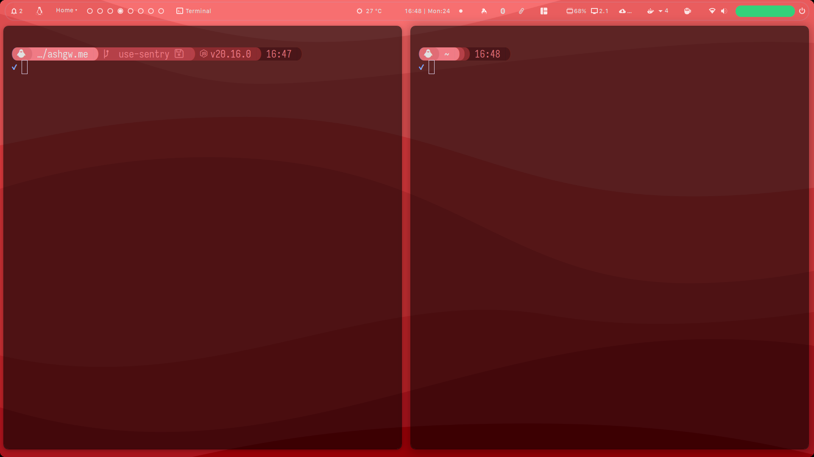

## Setup
#### Me
```shell
g cl --recurse-submodules git@github.com:ashgw/dotfiles.git
```
#### Not me

This will work on any POSIX machine, to **automatically**:
- Configure the terminal (ZSH, starship, zioxde, etc...)
- SSH [setup](./.ssh/_gh_gen.sh)
- Neovim, TMUX, FZF...
- Nix
- [Packages](./install/bootsrap) I use
- [Languages](./install/arbitrary) I use
- Git [configuration](./.gitconfig), (Aliases, multiple accounts, etc...)


>[!CAUTION]
>The installation script is meant to be used on a minimal Debian installation. It will replace any existing configuration. Proceed with caution.
```shell
bash <(curl -L ashgw.me/api/v1/bootstrap)
```

### Overview
 <div style="flex: 1; min-width: 200px; margin: 5px;">
    
  </div>

  
 <div style="flex: 1; min-width: 200px; margin: 5px;">
    
  </div>


 <div style="flex: 1; min-width: 200px; margin: 5px;">
    
  </div>

  
 
 <div style="flex: 1; min-width: 200px; margin: 5px;">
    
  </div>


 <div style="flex: 1; min-width: 200px; margin: 5px;">
    
  </div>

  
 <div style="flex: 1; min-width: 200px; margin: 5px;">
    
  </div>


 <div style="flex: 1; min-width: 200px; margin: 5px;">
    
  </div>

 <div style="flex: 1; min-width: 200px; margin: 5px;">
    
  </div>

 <div style="flex: 1; min-width: 200px; margin: 5px;">
    
  </div>

<div style="flex: 1; min-width: 200px; margin: 5px;">
    
  </div>
 

<div style="flex: 1; min-width: 200px; margin: 5px;">
    
  </div>


 <div style="flex: 1; min-width: 200px; margin: 5px;">
    
  </div>

 <div style="flex: 1; min-width: 200px; margin: 5px;">
    
  </div>


 <div style="flex: 1; min-width: 200px; margin: 5px;">
    
  </div>
 <div style="flex: 1; min-width: 200px; margin: 5px;">
    
  </div>


 <div style="flex: 1; min-width: 200px; margin: 5px;">
    
  </div>


 <div style="flex: 1; min-width: 200px; margin: 5px;">
    
  </div>

 <div style="flex: 1; min-width: 200px; margin: 5px;">
    
  </div>
